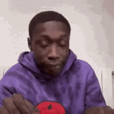
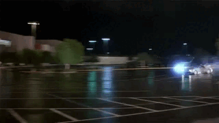

## Привет, меня зовут Рустам👋.

#### Мне нравится тестировать, писать код и учиться новому.
#### Здесь я буду писать свои мысли об успехах и неудачах в нашем нелегком труде😄😄😄

#### Моя статистика с публичными репозиториями:

## Добро пожаловать на мою страничку github

  

### Здесь может находиться мой сертификат с вашего курса😄😄😄

  

## Дипломный проект школы <a target="_blank" href="https://qa.guru">QA GURU</a>
## Тестирование UI
:link: Тестовый проект: <a target="_blank" href="https://github.com/Rustamw888/StackoverflowUITests">StackoverflowUITests</a>  

:rocket: Реализованы UI тесты для сайта https://ru.stackoverflow.com/.  

## Тестирование REST API
:link: Тестовый проект: <a target="_blank" href="https://github.com/Rustamw888/LingualeoApiTests">LingualeoApiTests</a>  

:rocket: Реализованы REST API тесты для сайта https://lingualeo.com/ru.  

## Тестирование мобильного приложения
:link: Тестовый проект: <a target="_blank" href="https://github.com/Rustamw888/JavaRushMobileTests">JavaRushMobileTests</a>  

:rocket: Реализованы тесты для мобильного приложения для https://javarush.ru/.  

  

